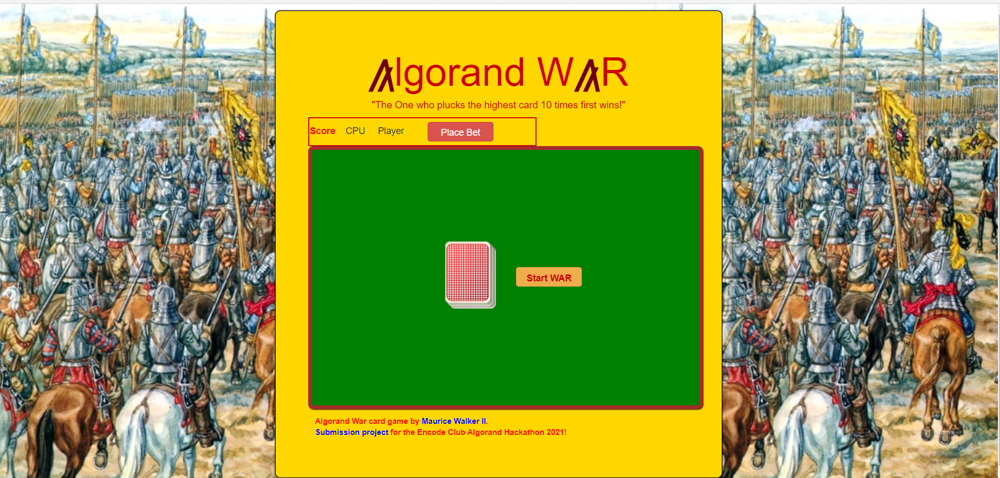

<h1 style="color:#cc0000;text-align:center;">lgorand WR</h1>
	
<h2 style="text-align:center;">"The One who plucks the highest card 10 times first wins!"</h2>

<h2>Submission project for <a href="https://www.encode.club/encode-algorand-hackathon">Encode Club Algorand Hackathon</a> by Maurice Walker II</h2>

<h3>&hearts;&nbsp; Introduction &nbsp;&hearts;</h3>

Algorand War card game is an exciting and fun web application for card game lovers everywhere. The classic game of War with smart contract betting capability is available for playing and testing <a href="https://algorandwar.herokuapp.com">here now</a>.

<h3>&spades;&nbsp; Features &nbsp;&spades;</h3>
<ul>
 <li>User-Friendly Interface</li>
 <li>Efficient and time-saving</li>
 <li>Minimal requirements needed</li>
 <li>Accessible from anywhere and anytime</li>
 <li>Eligible for all age groups</li>
</ul>

<h3>&diams;&nbsp; Software Used &nbsp;&diams;</h3>
  <ul>
    <li>HTML</li>
    <li>CSS</li>
    <li>Javascript</li>
    <li>Python</li>
    <li>TEAL</li>
  </ul>

<h3>&clubs;&nbsp; Screenshots &nbsp;&clubs;</h3>
